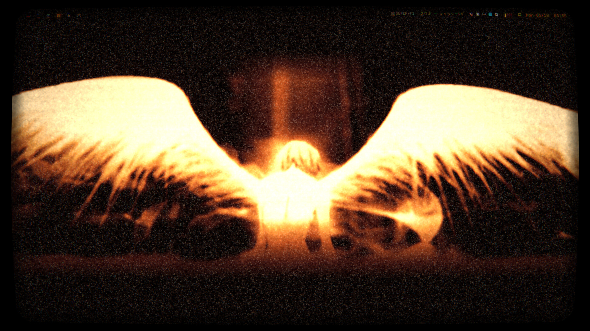
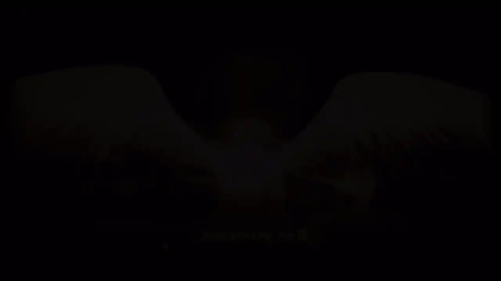
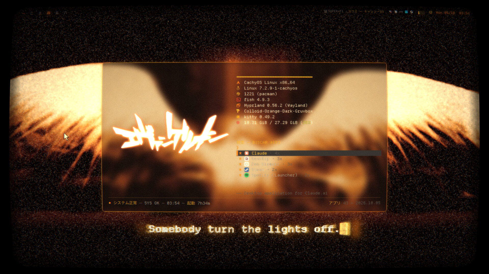
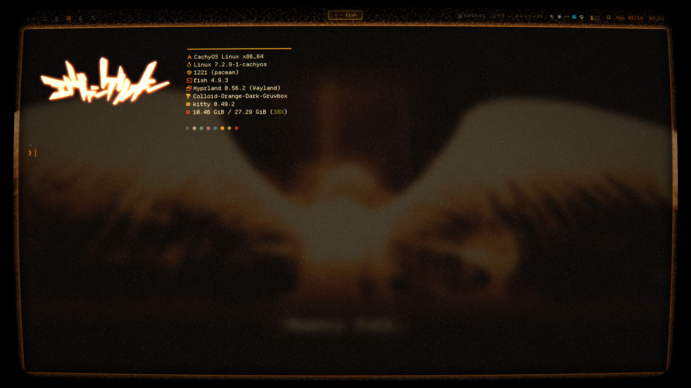
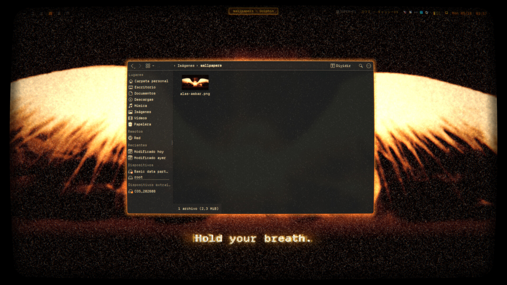
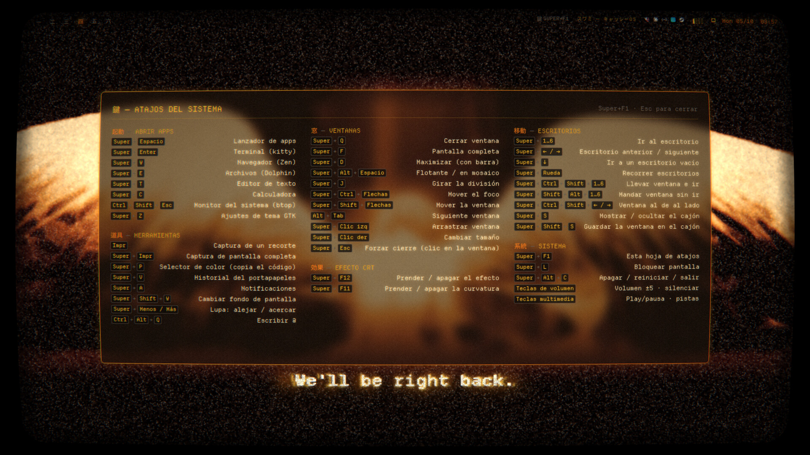

# evangelion-dotfiles

Rice retro-futurista para **Hyprland** con estética de anime de los 90
(Evangelion / Cowboy Bebop): monitor CRT ámbar, paleta Gruvbox, tipografía
pixel, grano de película y subtítulos que aparecen solos en el escritorio.

Corre sobre **CachyOS** (Arch) con **Hyprland 0.56** y su configuración en
**Lua**, en una sesión UWSM.





[▶ Video con sonido (mp4, 1:10)](videos/demo.mp4): pantalla de carga, arranque MAGI,
lanzador, terminales, atajos, efecto CRT, Zen, Dolphin y el modo consola.

| Lanzador | Terminal |
|---|---|
|  |  |
| **Archivos** | **Hoja de atajos (Super+F1)** |
|  |  |

## Qué incluye

| Pieza | Qué hace | Dónde |
|---|---|---|
| Efecto CRT | Shader con líneas de barrido, brillo cálido, viñeta y curvatura opcional. Se apaga solo en pantalla completa y con juegos | `.config/hypr/shaders/crt.frag`, `config/shader.lua` |
| Lanzador | Quickshell: logo grande, info del sistema tipo máquina de escribir, buscador difuso con íconos y encendido de tubo CRT | `.config/quickshell/rice-launcher` |
| Subtítulos | Frases al azar en inglés, letra por letra, sobre el fondo ("OK computer.") | `.config/quickshell/rice-subs` |
| Grano | Puntitos claros animados sobre el fondo y, muy suaves, dentro de las apps del sistema | `.config/quickshell/rice-noise`, `rice-static` |
| Arranque MAGI | Al iniciar sesión: los tres MAGI votan sobre fósforo ámbar, con encendido de tubo, sonido de PC vieja y glitch digital | `.config/quickshell/rice-boot` |
| Fondo vivo | Glitch digital a ráfagas (macrobloques que se corren o se pixelan) y grano, solo con el escritorio vacío | `.config/quickshell/rice-wallfx`, `rice-fx` |
| Modo consola | Super+G: menú tipo consola con juegos recientes, biblioteca de Steam/Epic/Xbox/GOG con portadas y búsqueda, mando o teclado. Los juegos de Windows reinician la PC directo al juego | `.config/quickshell/rice-console`, `.config/rice-console` |
| Bloqueo NERV | Pantalla de bloqueo propia (拒否 en rojo al errar la clave); hyprlock queda de respaldo | `.config/quickshell/rice-lock`, `scripts/lock.sh` |
| Apagado de tubo | Al apagar/reiniciar/salir la imagen se aplasta a una línea y a un punto | `.config/quickshell/rice-off`, `scripts/crt-off.sh` |
| Sonidos | Efectos sintetizados (abrir apps, menús, teclas) y música ambiente suave con el escritorio vacío | `.config/rice-sound`, `.config/quickshell/rice-sound` |
| Pantalla de carga | Tema de Plymouth "SINCRONÍA" con dial de progreso, osciloscopios y glitch | `.config/rice-limine/plymouth` |
| Interferencia VHS | Cada tanto, una franja de tracking recorre el borde de la ventana activa | `.config/quickshell/rice-static` |
| Hoja de atajos | Super+F1 o clic en la barra | `.config/quickshell/rice-keys` |
| Capturas | Menú con recorte, pantalla, ventana y lazo libre | `.config/quickshell/rice-shot` |
| Grabación | Pantalla + audio del sistema + micrófono (que se prende desde la barra) | `.config/hypr/scripts/record.sh` |
| Fondos | Estáticos o de Wallpaper Engine, con vista previa (Super+Shift+W) | `.config/hypr/scripts/wallpaper.sh` |
| Cursor | Pixel art crema hecho desde un pack, generado con Python | `.config/hypr/cursor-gen` |
| Barra, notificaciones, OSD | waybar, swaync, swayosd, hypridle | `.config/waybar`, etc. |
| Terminal | kitty + fish + fastfetch con el logo | `.config/kitty`, `fish`, `fastfetch` |
| Apps | GTK (Colloid Gruvbox naranja), Qt/KDE, btop, micro, Alacritty, bat, eza, fzf, mpv, GNOME Text Editor, Meld, EasyEffects, Spotify (Spicetify), Vesktop y Zen | ver abajo |

## Atajos

| Teclas | Acción |
|---|---|
| Super+Espacio | Lanzador de apps |
| Super+Enter | Terminal (kitty) |
| Super+W / Super+E | Navegador (Zen) / Archivos (Dolphin) |
| Super+F1 | Hoja con **todos** los atajos |
| Super+Q | Cerrar ventana |
| Super+F / Super+D | Pantalla completa / Maximizar |
| Super+1…6, Super+← / → | Escritorios |
| Super+Shift+S | Menú de capturas |
| Super+Shift+D | Grabar pantalla |
| Super+Shift+W | Cambiar fondo |
| Super+V | Historial del portapapeles |
| Super+G | Modo consola |
| Super+F12 / Super+F11 | Efecto CRT / curvatura |
| Super+F10 | Silenciar / activar sonidos |
| Super+L | Bloquear |
| Super+Shift+Supr | Apagar / reiniciar / salir |

## Dependencias

```sh
# base
sudo pacman -S hyprland uwsm quickshell waybar swaync swayosd hyprlock hypridle \
  hyprpolkitagent awww cliphist wl-clipboard grim slurp wf-recorder imagemagick \
  kitty fish fastfetch fzf bat eza btop micro mpv easyeffects qt6ct xsettingsd \
  noto-fonts-cjk python-numpy python-pillow
# fuente: Departure Mono Nerd Font (nerdfonts.com)
# pantalla de carga: plymouth · recompilar shaders: qt6-shadertools (qsb)
# opcionales: zen-browser-bin, spicetify-cli, vesktop-bin, linux-wallpaperengine-git (AUR)
```

Tema GTK: [Colloid](https://github.com/vinceliuice/Colloid-gtk-theme), compilado con:

```sh
./install.sh -t orange -c dark --tweaks gruvbox
```

## Instalación

> Hacé un respaldo de tu `~/.config` antes. El repo incluye `rice-rollback.sh`,
> que restaura un respaldo desde la TTY.

```sh
git clone https://github.com/swamidri-cyber/evangelion-dotfiles
cd evangelion-dotfiles
cp -r .config/* ~/.config/
cp -r .local/share/* ~/.local/share/
cp .config/kdeglobals .config/easyeffectsrc ~/.config/
mkdir -p ~/Imágenes/wallpapers && cp wallpapers/* ~/Imágenes/wallpapers/

# cursor
python3 ~/.config/hypr/cursor-gen/rice-pack-cursor.py
```

Después:

- Reemplazá `/home/swami` por tu home en `.config/gtk-4.0/gtk.css` y
  `.config/swayosd/config.toml`.
- **Zen:** copiá `zen/user.js` y `zen/chrome/` a tu perfil
  (`~/.config/zen/<perfil>/`).
- **Spotify:** `spicetify config current_theme Rice color_scheme gruvbox && spicetify apply`.
- El interruptor `RICE_SHELL` de `.config/hypr/config/variables.lua` elige
  entre este rice (`"rice"`) y Noctalia (`"noctalia"`).
- **Pantalla de carga:** copiá `.config/rice-limine/plymouth/rice-magi/` a
  `/usr/share/plymouth/themes/rice-magi/`, después
  `sudo plymouth-set-default-theme rice-magi` y regenerá el initramfs
  (en CachyOS con Limine: `sudo limine-mkinitcpio`).
- **Modo consola:** `python3 ~/.config/rice-console/scan/scan.py` arma la lista
  de juegos. Para lanzar juegos de Windows hace falta el ayudante
  (`.config/rice-console/system/install.sh`, con sudo) y el agente de
  `windows/install.ps1` del lado de Windows.
- **Demo:** `.config/rice-demo/demo-rapido.py` reproduce el recorrido del video
  con un mouse y teclado virtuales (`/dev/uinput`) y lo graba.
- Teclado latinoamericano y un monitor 1080p: ajustá `config/inputs.lua` y
  `config/monitors.lua`.

## Mantenimiento

`sync.sh` copia la configuración desde `$HOME` al repo (sin respaldos):

```sh
./sync.sh && git add -A && git commit -m "actualizo" && git push
```

## Créditos

- Las imágenes de fondo con alas y el logo original
  (`.config/rice-logo/original.png`) son de autores ajenos y se incluyen solo
  como referencia del rice. Sus derechos son de sus autores.
- El pack de cursores pixel art (`.config/hypr/cursor-gen/pack/pack.png`) es de
  su autor original; aquí se recolorea.
- *Neon Genesis Evangelion* es propiedad de Khara / Gainax. Este proyecto es
  un fan-rice sin fines comerciales.
- Paleta [Gruvbox](https://github.com/morhetz/gruvbox), tema
  [Colloid](https://github.com/vinceliuice/Colloid-gtk-theme), fuente
  [Departure Mono](https://departuremono.com).
